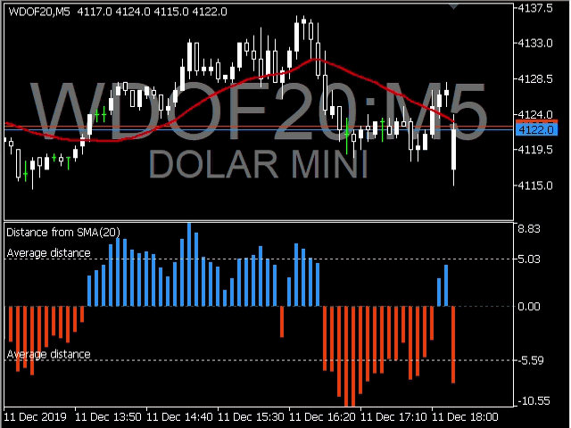
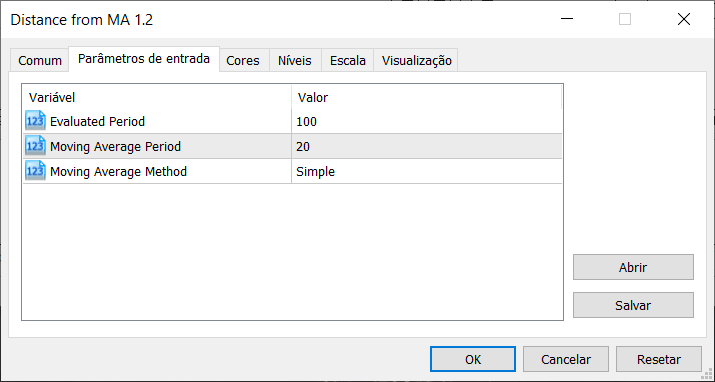

## MetaTrader 5 > Indicator > Distance from Moving Average

### Description:
This indicator measures the largest distance between a price (high or low) and a moving average. It may come in handy for strategies that open reverse positions as price moves away from a moving average within a certain range, awaiting it to return so the position can be closed.

It just works on any symbol on any timeframe.

### Parameters:

* **Evaluated Period**: Number of bars to be evaluated. Defaults to 100.
* **Moving Average Period**: Period for moving average calculation.
* **Moving Average Method**: You can choose between "Simple", "Exponential", "Smoothed" and "Linear-weighted" moving average methods.

----
### Instructions:
1. Copy this project folder to your **MetaEditor** indicator folder.
2. Select the *.mq5* file and click *'Compile'* button on **MetaEditor**.
3. On **MetaTrader**, insert this compiled indicator into the chart you want.

----
### References:
* [MQL5 Documentation](https://www.mql5.com/en/docs)

### MQL5 Market:
* [My MQL5 Published Products](https://www.mql5.com/en/users/leonardo_splinter/seller)